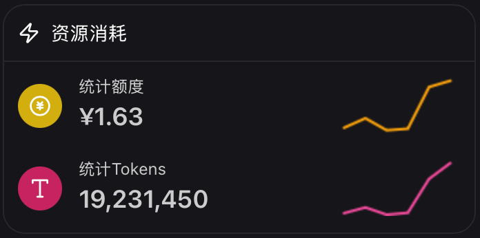

### Preface

   2022 年底，我第一次用上GPT-3.5。那时候我就想——好吧，这东西能干什么？答案是：几乎什么都能，能用及其自信的语气写一堆狗屁不通的东西。2023 年 5 月，用它写讨魏檄文、写化竞题，也绝对不会想到这么个一本正经地胡说八道的东西今天会成为生活中不可或缺的一部分。

### Coding

  对我们专业来说，Vibe Coding 几乎能解决所有技术问题。进组的半年来，也有了不少适合自己的反代网站，下面是我常用的反代网站：
  
  - [Anyrouter](https://anyrouter.top/register?aff=aB1J)：一个公益网站，专门提供CC反代，无法充值，每天送 25刀 余额，每邀请一个人，邀请人和被邀请人各可以得 50刀。不过 Opus 模型在工作日白天几乎不可用，加班的时候可以多试试。
  - 
  - [IKunCode](https://api.ikuncode.cc/register?aff=vpf6)：比较全面的反代网站，不过它提供的 Codex 反代非常划算，连续用 GPT5.4-Medium 蹬一小时也只花了3¥左右，并且命中率极高，适合白天工作时使用。Codex 客户端支持第三方 API，最近在 macOS 端 Codex 推出的 Computer Use 插件也能用，跟半个 OpenClaw 差不多了。
  - 
 {.img-center}
  - [GitHub Copilot](https://github.com/copilot) ：曾经的主力，现在的备胎。4月初学生包大刀一挥，砍得干干净净。现在它的主要用途是：偶尔想试试 Gemini 新模型时，充当一个启动器。这不是它的错，这是时代的眼泪。
  - 
  管理这些 API ，可以用[CC Switch](https://github.com/farion1231/cc-switch)  ，配置好各个 Vibe Coding 客户端的服务商非常方便。

### Paper Reading

  大模型对于 PDF 的阅读效率太低，如果是很多 PDF 一起丢给 LLM，它们的注意力很容易大幅下降。为了解决这个问题，可以在本地部署[MinerU](https://mineru.net)把 PDF 转 Markdown，不仅能自动读取文字排版格式，还能准确输出图片、公式、甚至**化学式**。
  
  除了给大模型看，我自己也得看论文，如果刚接触这个领域的英文论文，看得实属烦人，Zotero 中的 [pdf2ch](https://github.com/guaguastandup/zotero-pdf2zh) 插件做翻译器准确率还可以，可以配合**硅基流动**的其他一些模型使用，不过翻译过程很吃 token。 
