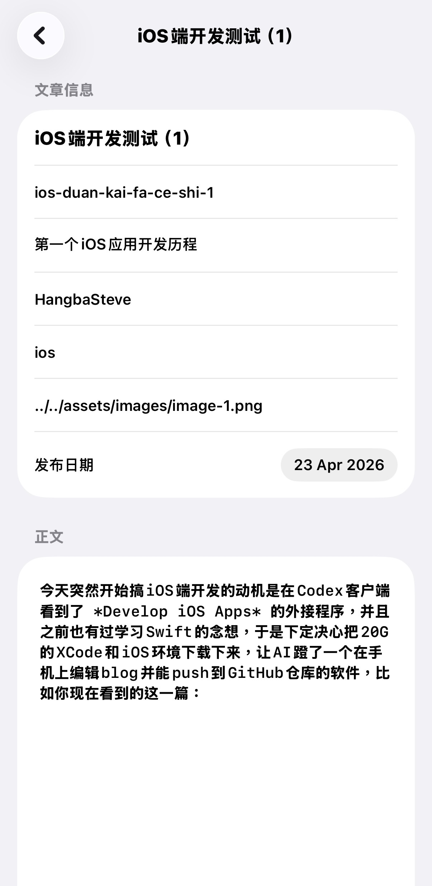

今天突然开始搞iOS端开发的动机其实非常朴素：我在Codex客户端看到了 *Develop iOS Apps* 的外接程序

再加上之前也有过学习Swift的念头，于是下定决心把20G的XCode和iOS环境下载下来，让AI蹬了一个在手机上编辑blog并能push到GitHub仓库的软件，比如你现在看到的这一篇：

 {.img-center width="30%"}

就是用这个软件发的。

实际上最后在token上只花了2毛钱，不过Apple Developer注册那卡了挺久，本来9点就打算回宿舍的结果拖到了十点半🕥……
